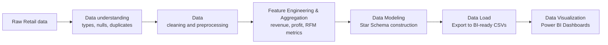

<div align="center">

#  Aurora Bank  - Crisis Diagnostic & Recovery Strategy in 2020

### *An End-To-End Banking Analytics Pipeline From Aurora bank Data To SQL Server And Power BI*

<p>
  
   
</p>

</div>

---

## Introduction


## Repository Structure

```text
Aurora_Banking_Project/
├── data/
│   ├── customers_data.csv
│   ├── products_data.csv
│   ├── sales_data.csv
│   └── stores_data.csv
│           
├── Dashboard_photo/
│   ├── RA_1619.png
│   ├── RA_20.png
│   └── RA_1920
├── aurora_bank.pdf
├── aurora_bank.pbix
├── aurora_bank.sql
└── README.md
```
## Table of Contents

- [Context](#context)
- [Dataset Overview](#Dataset-Overview)
- [Dataset Note](#dataset-note)
- [Data Pipeline](#data-pipeline)
- [Dimensional Model](#dimensional-model)
- [Power BI Dashboard](#power-bi-dashboard)
- [Project Analysis](#project-analysis)
- [Recommandation](#recommandation)
- [Conclusion](#conclusion)

## Context

## Dataset Overview

### Main data files

| File| Role | Description |
| --- | --- | --- |
|`customers_data.csv` | Dimension table containing demographics and summarized consumer behavior for each individual customer | Enriched using SQL CTEs. The new structure joins raw demographic data with aggregated metrics, creating a complete framework for RFM modeling and Cohort Analysis. |
| `products_data.csv` | Dimension table providing master data for the entire product catalog. | Kept in its original state. Contains product identification attributes (SKU, brand, color), product hierarchy structure (category, subcategory), and unit-level financial metrics (unit price, unit cost).|
| `sales_data.csv` | The central Fact table recording the global order history. This is the primary data source for revenue and operational dashboards. | Comprehensively transformed via SQL: **Missing Data Handling**: Null `delivery_date` values were imputed using the corresponding `order_date`. **Pre-calculated Metrics (Row-level math)**: Core financial metrics (`revenue`, `cost`, `profit`) were computed in advance at the transaction level to optimize Power BI dashboard load times. **Feature Engineering**: Created new operational variables, including delivery delay duration (`delivery_delay_days`) and distribution channel classification (`order_channel`: In-Store vs. Online).|
| `stores_data.csv` | Dimension table storing the profiles of physical retail locations operated by Global Retail Holdings. | Kept in its original state. Provides geographical data (country, state) and physical scale attributes (square_meters, open_date) to support regional performance analysis.|

## Dataset Note

> ⚠️ This dataset is used only for learning, analysis, and project demonstration purposes. It is not a production dataset from a real business environment.

## Data Pipeline


- Extract: Ingest raw operational data from the core retail database (OLTP).
- Transform: Execute SQL transformation scripts to handle missing data, perform row-level financial math (revenue, profit), calculate operational KPIs (delivery_delay_days), and aggregate customer lifetime metrics (RFM base).
- Load & Model: Structure the transformed data into a BI-ready Star Schema, consisting of one Fact table (sales_data) connected via primary/foreign keys to three Dimension tables (customers_data, products_data, stores_data).
- Serve: Connect Power BI directly to this modeled dataset to publish automated, interactive marketing and operational dashboards.
- Orchestrate: Deploy a scheduler (e.g., Apache Airflow) to automate the ETL refresh cycle daily.
## Dimensional Model 

```mermaid
erDiagram
    %% Fact Table
    Fact_Sales {
        string order_number
        date order_date
        date delivery_date
        int customer_key FK
        int store_key FK
        int product_key FK
        int quantity
        float revenue
        float cost
        float profit
        int delivery_delay_days
        string order_channel
    }

    %% Dimension Tables
    Dim_Customers {
        int customer_key PK
        string gender
        string name
        string city
        string state_code
        string state
        string zip_code
        string country
        string continent
        date birthday
        date first_purchase_date
        date last_purchase_date
        float lifetime_spend
        int total_orders
        int months_since_first_purchase
    }

    Dim_Products {
        int product_key PK
        string product_name
        string brand
        string color
        float unit_cost_usd
        float unit_price_usd
        int subcategory_key
        string subcategory
        int category_key
        string category
    }

    Dim_Stores {
        int store_key PK
        string country
        string state
        float square_meters
        date open_date
    }

    %% Relationships (Star Schema)
    Fact_Sales }|--|| Dim_Customers : "purchased_by"
    Fact_Sales }|--|| Dim_Products : "contains"
    Fact_Sales }|--|| Dim_Stores : "placed_at"
```


## Data Processing Operations Using SQL Server

### 1. ROW-LEVEL METRICS & OPERATION METRICS
**Objective**: Prepare granular data for dashboards and  Export the processed data to a file named `sales_data` 

- Handle Missing Data
- Calculate overall revenue, cost
- Calculate the number of delivery days
- Channel Classification 

```


```

### 2.CUSTOMER COHORT & LIFETIME METRICS (RFM BASE)
**Objective**: Analyze customer behavior to support Cohort segmentation and Export the processed data to a file named `customers_data`.

```

```

## Power BI Dashboard
The repository includes the Power BI report file
- Recommand : Download it to your device for convenient operation on the dashboard. 
```text
aurora_bank.pbix
```
## Project Analysis

### Analysis of Operational Performance

  
<p align="center">
    
</p>


<p align="center">
    
</p>

### **The Issue**

<p align="center">
    
</p>
  
First, I broke down the revenue using the following formula:

``

The analysis results show:


**The root cause lies in the sharp decline in order volumes.**

Conduct a deeper analysis by market and product category to assess:
| N°| Questions |
| --- | --- |
|1| Where are orders declining, and which customer segment is driving the largest drop?|
| 2 | Does the impact vary across markets? |
| 3 | Which region is most severely affected? |
| 4 | Which markets are showing signs of early recovery? |
| 5 | Which product categories are proving more resilient during this downturn?|

### Market Analysis

### Product Category Analysis

## Recommandation 


## Conclusion

