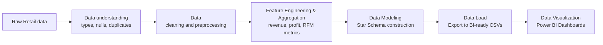
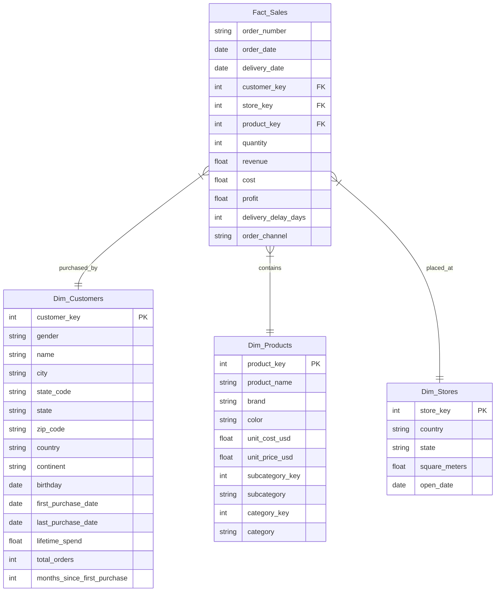

#  Retail Analytics - Crisis Diagnostic & Recovery Strategy in 2020

### *An End-To-End Retail Analytics Pipeline From Retail Data To SQL Server And Power BI*

  
   

---

## Introduction

An end-to-end data analytics and forecasting pipeline. The project turns raw transactional records into a cleaned analytical dataset, explores purchasing behavior, builds a dimensional data model, diagnoses a historical 49% drop in retail sales, compares machine learning approaches for demand forecasting, and publishes the BI-ready outputs into SQL Server for Power BI reporting.

## Table of Contents

- [Context](#context)
- [Dataset Overview](#Dataset-Overview)
- [Dataset Note](#dataset-note)
- [Data Pipeline](#data-pipeline)
- [Dimensional Model](#dimensional-model)
- [Power BI Dashboard](#power-bi-dashboard)
- [Project Overview](#project-overview)
- [Recommandation](#recommandation)
- [Conclusion](#conclusion)

## Context
- Global Retail Holdings is a multinational retail chain distributing consumer products—such as electronics, home appliances, accessories, and toys across 8 main categories (Computers, Cell Phones, Home Appliances, Audio, TV and Video, Games and Toys, Cameras and Camcorders, and Music)—in North America, Europe, Asia, and Australia. It operates a network of hundreds of physical stores across more than 20 countries, complemented by online sales channels.
- Operational structure: Organized according to a model of centralized merchandising and decentralized operations.
## Dataset Overview

### Main data files

| File| Role | Description |
| --- | --- | --- |
|`customers_data.csv` | Dimension table containing demographics and summarized consumer behavior for each individual customer | Enriched using SQL CTEs. The new structure joins raw demographic data with aggregated metrics, creating a complete framework for RFM modeling and Cohort Analysis. |
| `products_data.csv` | Dimension table providing master data for the entire product catalog. | Kept in its original state. Contains product identification attributes (SKU, brand, color), product hierarchy structure (category, subcategory), and unit-level financial metrics (unit price, unit cost).|
| `sales_data.csv` | The central Fact table recording the global order history. This is the primary data source for revenue and operational dashboards. | Comprehensively transformed via SQL: **Missing Data Handling**: Null `delivery_date` values were imputed using the corresponding `order_date`. **Pre-calculated Metrics (Row-level math)**: Core financial metrics (`revenue`, `cost`, `profit`) were computed in advance at the transaction level to optimize Power BI dashboard load times. **Feature Engineering**: Created new operational variables, including delivery delay duration (`delivery_delay_days`) and distribution channel classification (`order_channel`: In-Store vs. Online).|
| `stores_data.csv` | Dimension table storing the profiles of physical retail locations operated by Global Retail Holdings. | Kept in its original state. Provides geographical data (country, state) and physical scale attributes (square_meters, open_date) to support regional performance analysis.|

## Data Pipeline

- Extract: Ingest raw operational data from the core retail database (OLTP).
- Transform: Execute SQL transformation scripts to handle missing data, perform row-level financial math (revenue, profit), calculate operational KPIs (delivery_delay_days), and aggregate customer lifetime metrics (RFM base).
- Load & Model: Structure the transformed data into a BI-ready Star Schema, consisting of one Fact table (sales_data) connected via primary/foreign keys to three Dimension tables (customers_data, products_data, stores_data).
- Serve: Connect Power BI directly to this modeled dataset to publish automated, interactive marketing and operational dashboards.
- Orchestrate: Deploy a scheduler (e.g., Apache Airflow) to automate the ETL refresh cycle daily.
## Dimensional Model 

