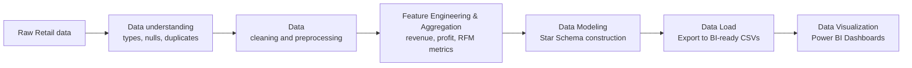
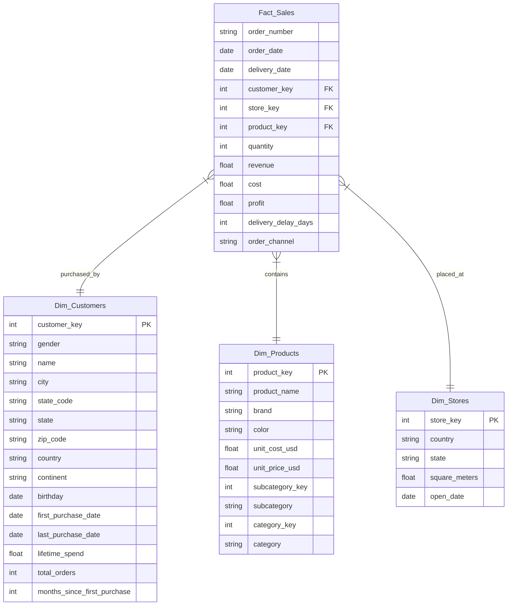
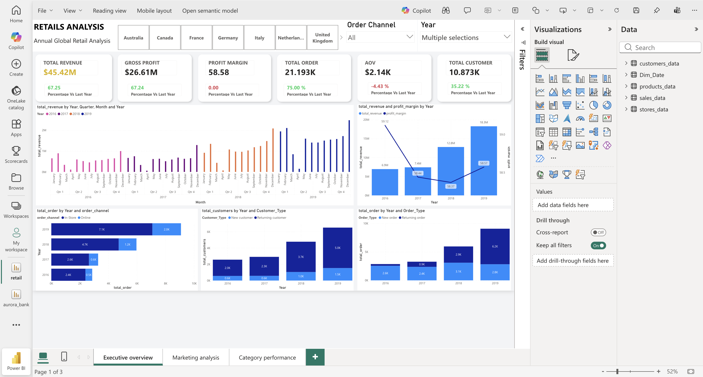
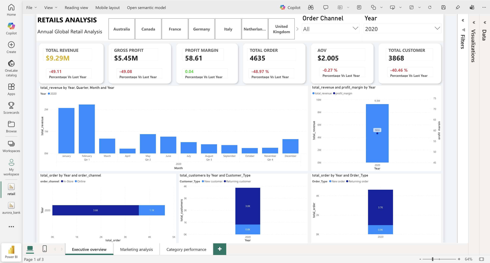

<div align="center">

#  Retail Analytics - Crisis Diagnostic & Recovery Strategy in 2020

### *An End-To-End Retail Analytics Pipeline From Retail Data To SQL Server And Power BI*

<p>
  
   
</p>

</div>

---

## Introduction

An end-to-end retail data analytics pipeline focused on crisis diagnostics and operational reporting. This project transforms raw transactional records into a cleaned analytical dataset, builds a Star Schema dimensional data model, and publishes BI-ready outputs into SQL Server for Power BI reporting. The core analysis explores purchasing behavior shifts and diagnoses the root causes behind a historical 49.1% year-over-year drop in global retail sales during the 2020 pandemic.

## Repository Structure

```text
Retail_Forecast_Project/
├── data/
│   ├── customers_data.csv
│   ├── products_data.csv
│   ├── sales_data.csv
│   └── stores_data.csv
│           
├── Dashboard_photo/
│   ├── RA_1619.png
│   ├── 
│   ├── 
│   └── 
├── Retail_Forecast.pptx
├── retail forecast.pdf
├── retail.pbix
└── README.md
```
## Table of Contents

- [Context](#context)
- [Dataset Overview](#Dataset-Overview)
- [Dataset Note](#dataset-note)
- [Data Pipeline](#data-pipeline)
- [Dimensional Model](#dimensional-model)
- [Power BI Dashboard](#power-bi-dashboard)
- [Project Analysis](#project-analysis)
- [Recommandation](#recommandation)
- [Conclusion](#conclusion)

## Context
- Global Retail Holdings is a multinational retail chain distributing consumer products—such as electronics, home appliances, accessories, and toys across 8 main categories (Computers, Cell Phones, Home Appliances, Audio, TV and Video, Games and Toys, Cameras and Camcorders, and Music)—in North America, Europe, Asia, and Australia. It operates a network of hundreds of physical stores across more than 20 countries, complemented by online sales channels.
- Operational structure: Organized according to a model of centralized merchandising and decentralized operations.
## Dataset Overview

### Main data files

| File| Role | Description |
| --- | --- | --- |
|`customers_data.csv` | Dimension table containing demographics and summarized consumer behavior for each individual customer | Enriched using SQL CTEs. The new structure joins raw demographic data with aggregated metrics, creating a complete framework for RFM modeling and Cohort Analysis. |
| `products_data.csv` | Dimension table providing master data for the entire product catalog. | Kept in its original state. Contains product identification attributes (SKU, brand, color), product hierarchy structure (category, subcategory), and unit-level financial metrics (unit price, unit cost).|
| `sales_data.csv` | The central Fact table recording the global order history. This is the primary data source for revenue and operational dashboards. | Comprehensively transformed via SQL: **Missing Data Handling**: Null `delivery_date` values were imputed using the corresponding `order_date`. **Pre-calculated Metrics (Row-level math)**: Core financial metrics (`revenue`, `cost`, `profit`) were computed in advance at the transaction level to optimize Power BI dashboard load times. **Feature Engineering**: Created new operational variables, including delivery delay duration (`delivery_delay_days`) and distribution channel classification (`order_channel`: In-Store vs. Online).|
| `stores_data.csv` | Dimension table storing the profiles of physical retail locations operated by Global Retail Holdings. | Kept in its original state. Provides geographical data (country, state) and physical scale attributes (square_meters, open_date) to support regional performance analysis.|

## Dataset Note

> ⚠️ This dataset is used only for learning, analysis, and project demonstration purposes. It is not a production dataset from a real business environment.

## Data Pipeline


```mermaid
flowchart LR
    A["Raw Retail data"] --> B["Data understanding<br/>types, nulls, duplicates"]
    B --> C["Data<br/>cleaning and preprocessing"]
    C --> D["Feature Engineering & Aggregation<br/>revenue, profit, RFM metrics"]
    D --> E["Data Modeling<br/>Star Schema construction"]
    E --> F["Data Load<br/>Export to BI-ready CSVs"]
    F --> M["Data Visualization<br/>Power BI Dashboards"]
```
- Extract: Ingest raw operational data from the core retail database (OLTP).
- Transform: Execute SQL transformation scripts to handle missing data, perform row-level financial math (revenue, profit), calculate operational KPIs (delivery_delay_days), and aggregate customer lifetime metrics (RFM base).
- Load & Model: Structure the transformed data into a BI-ready Star Schema, consisting of one Fact table (sales_data) connected via primary/foreign keys to three Dimension tables (customers_data, products_data, stores_data).
- Serve: Connect Power BI directly to this modeled dataset to publish automated, interactive marketing and operational dashboards.
- Orchestrate: Deploy a scheduler (e.g., Apache Airflow) to automate the ETL refresh cycle daily.
## Dimensional Model 


```mermaid
erDiagram
    %% Fact Table
    Fact_Sales {
        string order_number
        date order_date
        date delivery_date
        int customer_key FK
        int store_key FK
        int product_key FK
        int quantity
        float revenue
        float cost
        float profit
        int delivery_delay_days
        string order_channel
    }

    %% Dimension Tables
    Dim_Customers {
        int customer_key PK
        string gender
        string name
        string city
        string state_code
        string state
        string zip_code
        string country
        string continent
        date birthday
        date first_purchase_date
        date last_purchase_date
        float lifetime_spend
        int total_orders
        int months_since_first_purchase
    }

    Dim_Products {
        int product_key PK
        string product_name
        string brand
        string color
        float unit_cost_usd
        float unit_price_usd
        int subcategory_key
        string subcategory
        int category_key
        string category
    }

    Dim_Stores {
        int store_key PK
        string country
        string state
        float square_meters
        date open_date
    }

    %% Relationships (Star Schema)
    Fact_Sales }|--|| Dim_Customers : "purchased_by"
    Fact_Sales }|--|| Dim_Products : "contains"
    Fact_Sales }|--|| Dim_Stores : "placed_at"
```
## Data Processing Operations Using SQL Server

### 1. ROW-LEVEL METRICS & OPERATION METRICS
**Objective**: Prepare granular data for dashboards and  Export the processed data to a file named `sales_data` 

- Handle Missing Data
- Calculate overall revenue, cost
- Calculate the number of delivery days
- Channel Classification 

```

SELECT
    s.order_number,
    s.order_date,
    
    -- Handle Missing Data: Fallback to order_date if delivery_date is NULL
    COALESCE(s.delivery_date, s.order_date) AS adjusted_delivery_date,
    s.delivery_date AS original_delivery_date, -- Added alias to prevent column duplication
    
    s.customer_key,
    s.store_key,
    s.product_key,
    s.quantity,
    
    -- Row-level Financials
    CAST((s.quantity * p.unit_price_usd) AS NUMERIC(18,2)) AS revenue,
    CAST((s.quantity * p.unit_cost_usd) AS NUMERIC(18,2)) AS cost,
    CAST((s.quantity * (p.unit_price_usd - p.unit_cost_usd)) AS NUMERIC(18,2)) AS profit,
    
    -- Operational Metrics: Delivery Delay
    DATEDIFF(DAY, s.order_date, COALESCE(s.delivery_date, s.order_date)) AS delivery_delay_days,
    
    -- Channel Classification
    CASE 
        WHEN s.delivery_date IS NULL THEN 'In-Store'
        ELSE 'Online'
    END AS order_channel

FROM retails.sales AS s
JOIN retails.products AS p 
    ON s.product_key = p.product_key;

```

### 2.CUSTOMER COHORT & LIFETIME METRICS (RFM BASE)
**Objective**: Analyze customer behavior to support Cohort segmentation and Export the processed data to a file named `customers_data`.

```
WITH SystemParams AS (
    -- Optimization: Fetch max date once instead of calculating per row.
    SELECT MAX(order_date) AS max_system_date FROM retails.sales
),
CustomerBase AS (
    SELECT 
        s.customer_key,
        MIN(s.order_date) AS first_purchase_date,
        MAX(s.order_date) AS last_purchase_date,
        CAST(SUM(s.quantity * p.unit_price_usd) AS NUMERIC(18,2)) AS lifetime_spend,
        COUNT(DISTINCT s.order_number) AS total_orders
    FROM retails.sales AS s
    JOIN retails.products AS p 
        ON s.product_key = p.product_key
    GROUP BY s.customer_key
)
SELECT 
    c.*, 
    cb.first_purchase_date,
    cb.last_purchase_date,
    cb.lifetime_spend,
    cb.total_orders,
    
    -- Customer Tenure (Months)
    DATEDIFF(MONTH, cb.first_purchase_date, sp.max_system_date) AS months_since_first_purchase
FROM retails.customers AS c
LEFT JOIN CustomerBase AS cb 
    ON c.customer_key = cb.customer_key
CROSS JOIN SystemParams AS sp;
```

## Power BI Dashboard
The repository includes the Power BI report file
- Recommand : Download it to your device for convenient operation on the dashboard. 
```text
retail.pbix
```
## Project Analysis

### Analysis of Operational Performance
- During the 2016–2019 period, the company achieved solid growth in both revenue and profit.
  
<p align="center">
    
</p>

- As of the end of 2019:
  - The company had processed approximately 21,000 orders,
  - Recorded revenue of around USD 45 million,
  - Maintained a stable profit margin of approximately 58%.
    
Notably:
- 2018 saw the highest profit growth rate at 72.12%.
- In 2019, revenue peaked at USD 18.26 million, though the growth rate began to slow, dropping to 43.31%.
- Shopping demand was concentrated primarily in the first and fourth quarters of each year.
- (2019 vs. 2020) With both **Average Order Value (AOV) and margins remaining unchanged**, the decline did not stem from pricing or sales efficiency but rather **from volume (a sharp drop in the number of orders and customers)**.
- Comparing monthly patterns: figures for January/February 2020 remained comparable to those of 2019, indicating a stable start to the year, with the **decline becoming clearly evident from March onwards**.

### **The Issue**
- Despite achieving high revenue in Q1 2020, the total revenue for the year was only $9 million, representing a 49.1% year-over-year decline.
**Why did revenue drop by half in just one year? What were the causes, and what was the extent of the impact?**

<p align="center">
    
</p>
  
First, I broke down the revenue using the following formula:

`Revenue = Number of Orders × Average Order Value (AOV)`

The analysis results show:
- The sharp decline in revenue occurred after March—specifically, starting in April.
- The AOV dropped by only 0.3%—a negligible amount that had virtually no significant impact on the overall issue.
- Profit margins remained stable throughout 2020 at 58.61%.
- However, the number of orders and customers fell sharply; in 2020, there were only 3,868 customers and 4,635 orders.
- The decline coincided with the global outbreak of the COVID-19 pandemic. This likely had a severe impact on revenue due to social distancing regulations and disruptions to goods transportation.

**The root cause lies in the sharp decline in order volumes.**

Conduct a deeper analysis by market and product category to assess:
| N°| Questions |
| --- | --- |
|1| Where are orders declining, and which customer segment is driving the largest drop?|
| 2 | Does the impact vary across markets? |
| 3 | Which region is most severely affected? |
| 4 | Which markets are showing signs of early recovery? |
| 5 | Which product categories are proving more resilient during this downturn?|

### Market Analysis
**Global Performance Overview:**
- The US market remains the cornerstone of the business across all operational metrics, supported by a network of 20 physical stores.
- Average Order Value (AOV) in 2020 experienced a slight Year-over-Year (YoY) decline but remained robust at over $2,000 per order.
- Revenue per Square Meter is utilized as the primary KPI to evaluate the spatial efficiency and actual performance of each branch.
- In 2020, the US market recorded a severe revenue drop of 43.57%, which directly led to the permanent closure of the Utah branch.

**Root Causes:**
- A drastic decline in new customer acquisition; revenue generation became entirely heavily reliant on returning customers.
- Operational inefficiencies in low-performing branches heavily eroded the overall profit margin.
- The COVID-19 pandemic caused a massive drop in foot traffic, making it impossible for several stores to cover their fixed operational costs.

**Strategic Countermeasures** :
- Network Restructuring: Liquidate and close underperforming stores.
- Capital Reallocation: Channel investments into top-performing branches to strengthen customer retention programs and launch aggressive acquisition campaigns for new buyers.

_France, the UK, and Germany are identified as high-potential markets requiring tailored expansion strategies:_

**1. The French Market:**

- Despite generating a modest revenue volume compared to the US, France demonstrated a solid growth rate (pre-pandemic) and suffered the least financial impact during the COVID-19 crisis.

- The market shows high resilience and potential; all 4 current branches are operating at a highly efficient level.

- Customer mix is well-balanced between new and returning segments, although returning customers remain the primary revenue drivers.

**2. The UK Market:**

- Comprises 6 branches. In 2020, the market suffered a severe performance contraction, with Revenue per Square Meter plunging by 53.1% (most notably in the Ayrshire region).

- Root Causes: A sharp decline in total order volume. The customer base was stagnant with zero growth signals in new acquisitions, leaving the branches to survive solely on legacy customers.

- Solutions:Liquidate operations in severely contracted regions (e.g., Ayrshire) to stop cash burn. Reallocate capital to revamp the marketing strategy in the remaining viable UK branches to restart new customer acquisition.

**3. The German Market:**

- In 2018, Germany led the global network with a peak YoY growth of 124% (fueled by 81.4% returning customers and 18.6% new customers).

- Growth momentum decelerated to 49% in 2019 and hit rock bottom at -59% in 2020 due to the pandemic.

- Root Causes: Beyond the macroeconomic shock of COVID-19, underlying operational inefficiencies were evident early on, forcing the closure of the Brandenburg branch in 2019.

**4. Italy, Australia, Netherlands, Canada:**

- Maintained relatively stable revenue streams and customer mixes despite the global pandemic disruptions.

- Root Causes: A streamlined footprint (fewer store locations) allowed for agile management, localized risk mitigation, and stronger resilience against macro shocks.

- Solutions: Continue closing branches that cannibalize profits or create financial bottlenecks. Focus investments on premium branches to retain the core customer base and attract new footfall.

### Product Category Analysis
**1. Product Category Performance & Resilience.**

2020 witnessed a widespread contraction across all product catalogs due to the macroeconomic shock of COVID-19. However, this period served as a stress test, revealing the resilience levels of different product lines:

- Severely Impacted Categories: Home Appliances experienced the steepest plunge, with orders dropping by 60.91% and revenue by 58.99%. Audio equipment followed closely, with orders down 57.11% and revenue dropping 57.46%. These categories face a slow recovery trajectory.

- Core Category Contraction: Computers—the backbone of the retail network—suffered a massive hit, with orders decreasing by 49.27% and revenue falling by 47.33%.

- Relatively Resilient Categories: Entertainment and telecommunication devices demonstrated stronger resistance against the pandemic. Music,Movies and AudioBooks recorded the lowest revenue drop across the system (-43.86%), while TV & Video contained its order decline at -42.24%.

**2. Customer Behavior & Segment Shifts by Category.**

The aforementioned category performances are direct reflections of underlying shifts in customer behavior:
- Purchasing Power Drop among Returning Customers: The core loyalist segment significantly cut back spending on traditional flagship products, notably Computers (-3.71%), Home Appliances (-5.29%), and Audio (-6.33%). Since historical revenue heavily relies on this cohort, their spending pullback poses a severe threat to post-pandemic recovery.
- New Customer Acquisition & The Online Shift: While core physical categories plummeted, demand for home entertainment and connectivity (Cell Phones [+0.14%], Music & Movies [+0.15%], Cameras & Camcorders [+0.15%], and TV & Video [+0.12%]) stabilized, maintaining a modest new customer retention rate. This indicates a slight consumer pivot toward digital and entertainment goods, though it remains vastly insufficient to offset the catastrophic revenue losses from the in-store channel.
- Distribution Channel Bottleneck: The demand from these new buyers was predominantly channeled through Online platforms. However, this digital surge was vastly insufficient to offset the catastrophic revenue losses from the In-store channel, which traditionally drives the bulk of high-ticket sales (Computers, Appliances) and gross margins.

**3. Strategic Conclusion & Root Causes.**

The global revenue downturn is driven by two fundamental factors:
- Disrupted Consumer Behavior: A sudden shift in purchasing habits during lockdown protocols, heavily prioritizing home entertainment over high-value household or workspace items.
- Channel Imbalance: Over-reliance on the physical brick-and-mortar network. While the Online channel showed positive signals, it remains operationally immature, lacking the capability to bear the revenue load or drive uniform traction across the entire product catalog.

## Recommandation 

**1. Omnichannel Shift**

- Comprehensively upgrade online channels to offset declining foot traffic at physical stores and fully capture new customer segments.
- Integrate Online-to-Offline (O2O) experiences: Enable online ordering with in-store pickup and returns to maximize the utility of the existing retail network.

**2. Store Network Restructuring (Store Optimization)**

- Permanently close branches with consistently negative cash flow and low revenue-per-square-meter metrics (particularly in the US, UK, and Germany).
- Retain and upgrade high-performing stores (e.g., in France and Italy), converting a portion of their floor space into micro-fulfillment centers to support online channels.

**3. Merchandising Pivot**

- Increase inventory levels and allocate marketing budgets to entertainment and connectivity devices (phones, TVs & video equipment, audio gear, cameras) to capitalize on the "at-home" consumption trends of new customer segments.
- Launch inventory clearance and cross-selling campaigns, or create deeply discounted bundles for computers and home appliances, to reignite demand among existing customers.

**4. Customer Strategy (Restoring Cash Flow)**

- Redesign loyalty and VIP programs to include exclusive perks (such as cashback and extended warranties) aimed at reversing the sharp decline in spending among returning customers.
- Implement remarketing campaigns targeting customers acquired during the pandemic, converting them from one-time buyers into frequent shoppers.

## Conclusion

The 2020 fiscal year served as a severe stress test for Global Retail Holdings, exposing the vulnerabilities of a heavily physical, brick-and-mortar reliant business model. The diagnostic analysis confirms that the 49.1% revenue contraction was a volume-driven crisis, not a pricing or margin failure, as Average Order Value and Profit Margins remained strictly insulated.

The core takeaways are:

- Structural Vulnerability: The catastrophic drop in foot traffic paralyzed the primary revenue engines (Computers and Home Appliances), proving that the current decentralized operational structure lacks the agility to shift inventory to digital channels during macro-disruptions.

- Customer Base Fragility: The over-reliance on Returning Customers became a critical liability when their purchasing power contracted, while New Customer acquisition completely stagnated.

- The Path Forward: Recovery hinges on executing a definitive Omnichannel pivot. By purging high-cost, low-yield physical branches and converting viable real estate into micro-fulfillment hubs, the company can protect its baseline margins while repositioning its catalog to capture the growing digital-first consumer segment.
