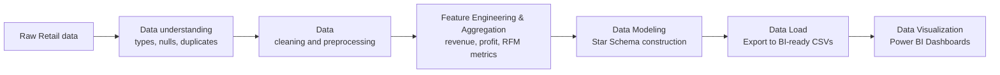
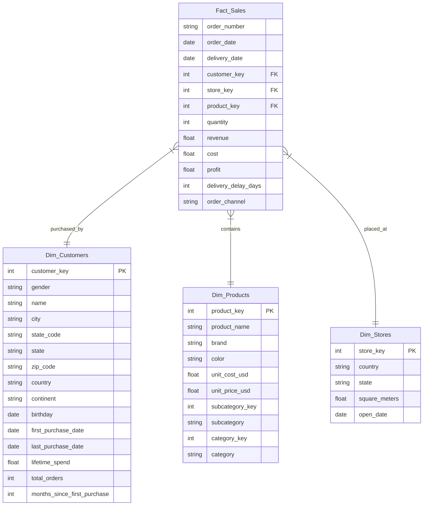

<div align="center">

#  Retail Analytics - Crisis Diagnostic & Recovery Strategy in 2020

### *An End-To-End Retail Analytics Pipeline From Retail Data To SQL Server And Power BI*

<p>
  
   
</p>

</div>

---

## Introduction

An end-to-end data analytics and forecasting pipeline. The project turns raw transactional records into a cleaned analytical dataset, explores purchasing behavior, builds a dimensional data model, diagnoses a historical 49% drop in retail sales, compares machine learning approaches for demand forecasting, and publishes the BI-ready outputs into SQL Server for Power BI reporting.

## Table of Contents

- [Context](#context)
- [Dataset Overview](#Dataset-Overview)
- [Dataset Note](#dataset-note)
- [Data Pipeline](#data-pipeline)
- [Dimensional Model](#dimensional-model)
- [Power BI Dashboard](#power-bi-dashboard)
- [Project Overview](#project-overview)
- [Recommandation](#recommandation)
- [Conclusion](#conclusion)

## Context
- Global Retail Holdings is a multinational retail chain distributing consumer products—such as electronics, home appliances, accessories, and toys across 8 main categories (Computers, Cell Phones, Home Appliances, Audio, TV and Video, Games and Toys, Cameras and Camcorders, and Music)—in North America, Europe, Asia, and Australia. It operates a network of hundreds of physical stores across more than 20 countries, complemented by online sales channels.
- Operational structure: Organized according to a model of centralized merchandising and decentralized operations.
## Dataset Overview

### Main data files

| File| Role | Description |
| --- | --- | --- |
|`customers_data.csv` | Dimension table containing demographics and summarized consumer behavior for each individual customer | Enriched using SQL CTEs. The new structure joins raw demographic data with aggregated metrics, creating a complete framework for RFM modeling and Cohort Analysis. |
| `products_data.csv` | Dimension table providing master data for the entire product catalog. | Kept in its original state. Contains product identification attributes (SKU, brand, color), product hierarchy structure (category, subcategory), and unit-level financial metrics (unit price, unit cost).|
| `sales_data.csv` | The central Fact table recording the global order history. This is the primary data source for revenue and operational dashboards. | Comprehensively transformed via SQL: **Missing Data Handling**: Null `delivery_date` values were imputed using the corresponding `order_date`. **Pre-calculated Metrics (Row-level math)**: Core financial metrics (`revenue`, `cost`, `profit`) were computed in advance at the transaction level to optimize Power BI dashboard load times. **Feature Engineering**: Created new operational variables, including delivery delay duration (`delivery_delay_days`) and distribution channel classification (`order_channel`: In-Store vs. Online).|
| `stores_data.csv` | Dimension table storing the profiles of physical retail locations operated by Global Retail Holdings. | Kept in its original state. Provides geographical data (country, state) and physical scale attributes (square_meters, open_date) to support regional performance analysis.|

## Data Pipeline


```mermaid
flowchart LR
    A["Raw Retail data"] --> B["Data understanding<br/>types, nulls, duplicates"]
    B --> C["Data<br/>cleaning and preprocessing"]
    C --> D["Feature Engineering & Aggregation<br/>revenue, profit, RFM metrics"]
    D --> E["Data Modeling<br/>Star Schema construction"]
    E --> F["Data Load<br/>Export to BI-ready CSVs"]
    F --> M["Data Visualization<br/>Power BI Dashboards"]
```
- Extract: Ingest raw operational data from the core retail database (OLTP).
- Transform: Execute SQL transformation scripts to handle missing data, perform row-level financial math (revenue, profit), calculate operational KPIs (delivery_delay_days), and aggregate customer lifetime metrics (RFM base).
- Load & Model: Structure the transformed data into a BI-ready Star Schema, consisting of one Fact table (sales_data) connected via primary/foreign keys to three Dimension tables (customers_data, products_data, stores_data).
- Serve: Connect Power BI directly to this modeled dataset to publish automated, interactive marketing and operational dashboards.
- Orchestrate: Deploy a scheduler (e.g., Apache Airflow) to automate the ETL refresh cycle daily.
## Dimensional Model 


```mermaid
erDiagram
    %% Fact Table
    Fact_Sales {
        string order_number
        date order_date
        date delivery_date
        int customer_key FK
        int store_key FK
        int product_key FK
        int quantity
        float revenue
        float cost
        float profit
        int delivery_delay_days
        string order_channel
    }

    %% Dimension Tables
    Dim_Customers {
        int customer_key PK
        string gender
        string name
        string city
        string state_code
        string state
        string zip_code
        string country
        string continent
        date birthday
        date first_purchase_date
        date last_purchase_date
        float lifetime_spend
        int total_orders
        int months_since_first_purchase
    }

    Dim_Products {
        int product_key PK
        string product_name
        string brand
        string color
        float unit_cost_usd
        float unit_price_usd
        int subcategory_key
        string subcategory
        int category_key
        string category
    }

    Dim_Stores {
        int store_key PK
        string country
        string state
        float square_meters
        date open_date
    }

    %% Relationships (Star Schema)
    Fact_Sales }|--|| Dim_Customers : "purchased_by"
    Fact_Sales }|--|| Dim_Products : "contains"
    Fact_Sales }|--|| Dim_Stores : "placed_at"
```
## Data Processing Operations Using SQL Server

### 1. ROW-LEVEL METRICS & OPERATION METRICS
**Objective**: Prepare granular data for dashboards and  Export the processed data to a file named `sales_data` 

- Handle Missing Data
- Calculate overall revenue, cost
- Calculate the number of delivery days
- Channel Classification 

```

SELECT
    s.order_number,
    s.order_date,
    
    -- Handle Missing Data: Fallback to order_date if delivery_date is NULL
    COALESCE(s.delivery_date, s.order_date) AS adjusted_delivery_date,
    s.delivery_date AS original_delivery_date, -- Added alias to prevent column duplication
    
    s.customer_key,
    s.store_key,
    s.product_key,
    s.quantity,
    
    -- Row-level Financials
    CAST((s.quantity * p.unit_price_usd) AS NUMERIC(18,2)) AS revenue,
    CAST((s.quantity * p.unit_cost_usd) AS NUMERIC(18,2)) AS cost,
    CAST((s.quantity * (p.unit_price_usd - p.unit_cost_usd)) AS NUMERIC(18,2)) AS profit,
    
    -- Operational Metrics: Delivery Delay
    DATEDIFF(DAY, s.order_date, COALESCE(s.delivery_date, s.order_date)) AS delivery_delay_days,
    
    -- Channel Classification
    CASE 
        WHEN s.delivery_date IS NULL THEN 'In-Store'
        ELSE 'Online'
    END AS order_channel

FROM retails.sales AS s
JOIN retails.products AS p 
    ON s.product_key = p.product_key;

```

### 2.CUSTOMER COHORT & LIFETIME METRICS (RFM BASE)
**Objective**: Analyze customer behavior to support Cohort segmentation and Export the processed data to a file named `customers_data`.

```
WITH SystemParams AS (
    -- Optimization: Fetch max date once instead of calculating per row.
    SELECT MAX(order_date) AS max_system_date FROM retails.sales
),
CustomerBase AS (
    SELECT 
        s.customer_key,
        MIN(s.order_date) AS first_purchase_date,
        MAX(s.order_date) AS last_purchase_date,
        CAST(SUM(s.quantity * p.unit_price_usd) AS NUMERIC(18,2)) AS lifetime_spend,
        COUNT(DISTINCT s.order_number) AS total_orders
    FROM retails.sales AS s
    JOIN retails.products AS p 
        ON s.product_key = p.product_key
    GROUP BY s.customer_key
)
SELECT 
    c.*, 
    cb.first_purchase_date,
    cb.last_purchase_date,
    cb.lifetime_spend,
    cb.total_orders,
    
    -- Customer Tenure (Months)
    DATEDIFF(MONTH, cb.first_purchase_date, sp.max_system_date) AS months_since_first_purchase
FROM retails.customers AS c
LEFT JOIN CustomerBase AS cb 
    ON c.customer_key = cb.customer_key
CROSS JOIN SystemParams AS sp;
```

## Power BI Dashboard
The repository includes the Power BI report file
- Recommand : Download it to your device for convenient operation on the dashboard. 
```text
retail.pbix
```

### Analysis of Operational Performance
- During the 2016–2019 period, the company achieved solid growth in both revenue and profit.

- As of the end of 2019:
  - The company had processed approximately 21,000 orders,
  - Recorded revenue of around USD 45 million,
  - Maintained a stable profit margin of approximately 58%.
Notably:
- 2018 saw the highest profit growth rate at 72.12%.
- In 2019, revenue peaked at USD 18.26 million, though the growth rate began to slow, dropping to 43.31%.
- Shopping demand was concentrated primarily in the first and fourth quarters of each year.
- The first quarter of 2020 got off to a successful start with revenue reaching USD 5 million—surpassing the figure from the same period the previous year.

